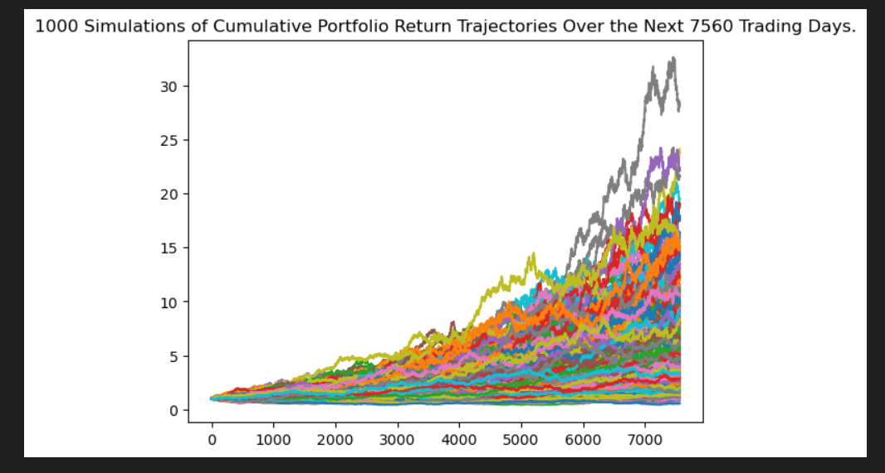
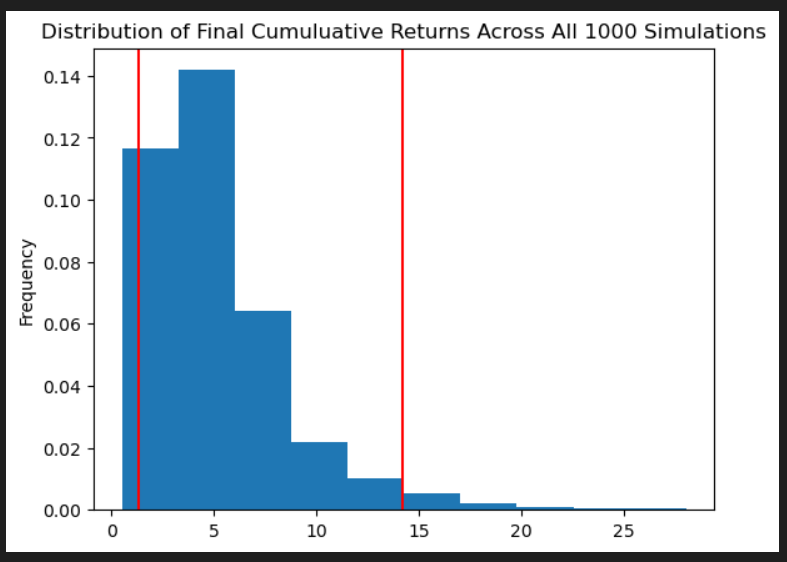
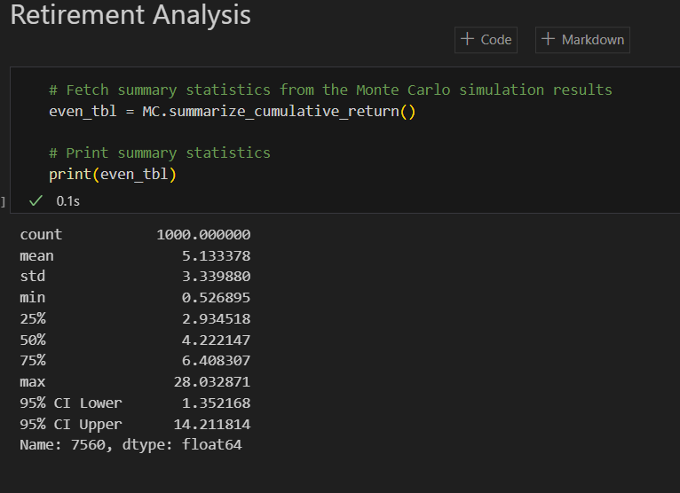
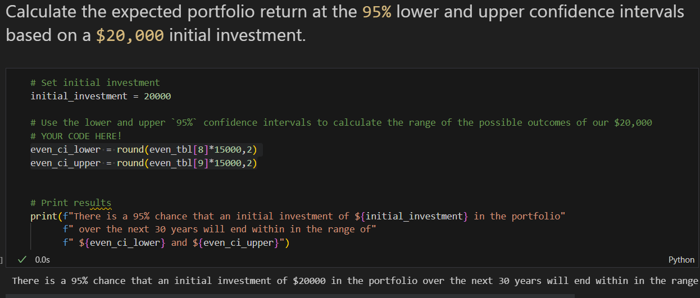

# Module 5 Assignment - API

This assignment has two sections: Financial Planning and Investment Forecast. Thei first section is relatively easy by reading API to fetch data for anaylise. The second section is related Monte Carlo simulation. This requires the following:

1. configuring the simulation
2. running the simulation
3. linear plotting the result
4. Density plotting the probability ditribution
5. Generating the simulation summary statics
6. Using 95% lower and upper confidence to evaluate the final value of the specific iniital investment.

## The following are a list of snapshots for review. 

1. Linear Plot

2. Distribution Plot

3. MC Summary Statistics

4. Expected Return Over the Years Within 95% Lower and Upper COnfidence Range

